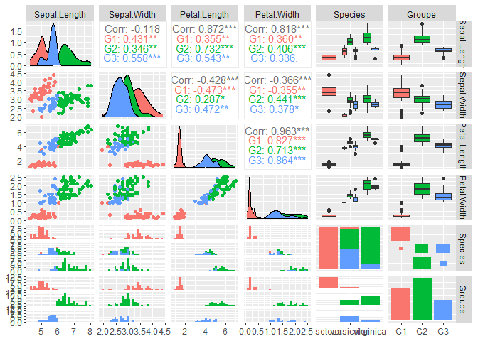

<!-- README.md is generated from README.Rmd. Please edit that file -->

# RFCLUST

<!-- badges: start -->
<!-- badges: end -->

The goal of RFCLUST is to …

## Installation

You can install the development version of RFCLUST from
[GitHub](https://github.com/) with:

``` r
# install.packages("devtools")
devtools::install_github("Alar0g/RFCLUST")
```

## Example

This is a basic example which shows you how to solve a common problem:

``` r
options(repos = c(CRAN = "https://cran.r-project.org"))

install.packages("devtools")
#> Installation du package dans 'C:/Users/alari/AppData/Local/R/win-library/4.3'
#> (car 'lib' n'est pas spécifié)
#> le package 'devtools' a été décompressé et les sommes MD5 ont été vérifiées avec succés
#> 
#> Les packages binaires téléchargés sont dans
#>  C:\Users\alari\AppData\Local\Temp\RtmpKEw3Ud\downloaded_packages
devtools::install_github("Alar0g/RFCLUST")
#> Using github PAT from envvar GITHUB_PAT
#> Skipping install of 'RFCLUST' from a github remote, the SHA1 (468c5c58) has not changed since last install.
#>   Use `force = TRUE` to force installation
library(RFCLUST)
#> Registered S3 method overwritten by 'GGally':
#>   method from   
#>   +.gg   ggplot2

Z = iris #dataset Iris

rfc <- rfclust(Z,T,10,2,1) # Génération of a forest of 10 trees, for 2 cluster and 1 variables for each tree. With a scaling on your data.

heatmaps <- heat(rfc) #Agregation of the forest + generate a heatmap.

analysis <- analyse(heatmaps[[1]],3,Z) # Analysis of the, eventually, 3 groups resulting from the first heatmap in the data Z.


## basic example code
```

What is special about using `README.Rmd` instead of just `README.md`?
You can include R chunks like so:

``` r
analysis[[2]]
#>   Sepal.Length    Sepal.Width     Petal.Length    Petal.Width   
#>  Min.   :4.300   Min.   :2.000   Min.   :1.000   Min.   :0.100  
#>  1st Qu.:5.100   1st Qu.:2.800   1st Qu.:1.600   1st Qu.:0.300  
#>  Median :5.800   Median :3.000   Median :4.350   Median :1.300  
#>  Mean   :5.843   Mean   :3.057   Mean   :3.758   Mean   :1.199  
#>  3rd Qu.:6.400   3rd Qu.:3.300   3rd Qu.:5.100   3rd Qu.:1.800  
#>  Max.   :7.900   Max.   :4.400   Max.   :6.900   Max.   :2.500  
#>        Species      Groupe         
#>  setosa    :50   Length:150        
#>  versicolor:50   Class :character  
#>  virginica :50   Mode  :character  
#>                                    
#>                                    
#> 
```

You’ll still need to render `README.Rmd` regularly, to keep `README.md`
up-to-date. `devtools::build_readme()` is handy for this.

You can also embed plots, for example:

    #> `stat_bin()` using `bins = 30`. Pick better value with `binwidth`.
    #> `stat_bin()` using `bins = 30`. Pick better value with `binwidth`.
    #> `stat_bin()` using `bins = 30`. Pick better value with `binwidth`.
    #> `stat_bin()` using `bins = 30`. Pick better value with `binwidth`.
    #> `stat_bin()` using `bins = 30`. Pick better value with `binwidth`.
    #> `stat_bin()` using `bins = 30`. Pick better value with `binwidth`.
    #> `stat_bin()` using `bins = 30`. Pick better value with `binwidth`.
    #> `stat_bin()` using `bins = 30`. Pick better value with `binwidth`.



In that case, don’t forget to commit and push the resulting figure
files, so they display on GitHub and CRAN.
